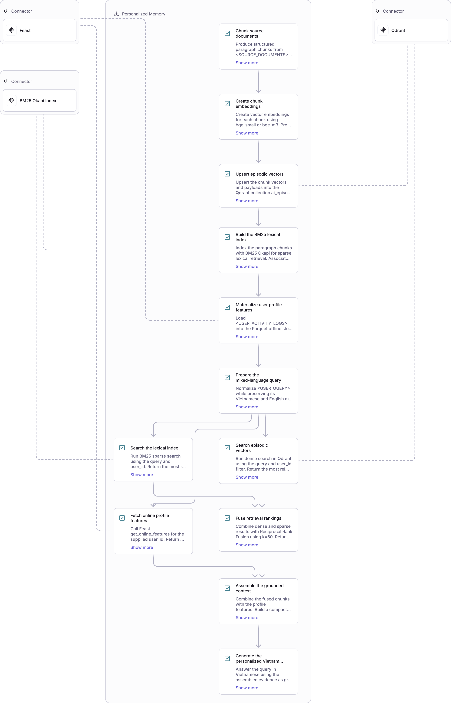

# Kiến Trúc Hệ Thống Bộ Nhớ Lai (Hybrid AI Memory Architecture)
**Dự án:** Trợ lý AI Cá nhân hóa cho Người dùng Việt Nam  
**Tác giả:** Nguyen Trung Kien (MSSV: 2A202602764) — Cohort: A20-K4  
**Bài nộp:** Bonus Challenge — Day 19: Vector Store & Feature Store  

---

## 1. Tổng quan bài toán và Sơ đồ kiến trúc (System Architecture)

Khi xây dựng một trợ lý AI cá nhân hóa (Personal AI Companion / NotebookLM cho người Việt), một hệ thống Retrieval-Augmented Generation (RAG) thông thường chỉ tập trung vào việc tìm kiếm văn bản liên quan tức thời. Tuy nhiên, một trợ lý thông minh thực thụ cần sở hữu hai tầng ký ức có đặc tính hoàn toàn khác nhau:
1. **Episodic Memory (Ký ức từng đoạn / sự kiện):** Ghi nhớ các cuộc trò chuyện trong quá khứ, tài liệu người dùng đã đọc, ghi chú cá nhân và các sự kiện diễn ra theo dòng thời gian. Tầng này có kích thước không giới hạn, đòi hỏi khả năng tìm kiếm ngữ nghĩa đa chiều và bắt từ khóa chính xác. $\rightarrow$ **Vector Database (Qdrant) kết hợp BM25 qua Reciprocal Rank Fusion (RRF).**
2. **Stable Profile & Dynamic Velocity (Hồ sơ người dùng & Hành vi tức thời):** Nắm bắt các thuộc tính định lượng ổn định (ngôn ngữ ưu tiên, tốc độ đọc, chủ đề quan tâm lâu dài) cùng các chỉ số vận tốc phiên hoạt động (số câu hỏi trong 1 giờ qua, sự mệt mỏi về đêm). $\rightarrow$ **Feast Feature Store (Online SQLite/Redis).**

### Sơ đồ luồng dữ liệu (Data Flow Diagram)

---

## 2. Ba Quyết Định Kiến Trúc Trọng Tâm và Đánh Đổi Kỹ Thuật (Architecture Trade-offs)

### Quyết định 1: Chiến lược phân đoạn (Chunking Strategy)
* **Lựa chọn:** **Semantic Paragraph-level Chunking (Phân đoạn theo đoạn văn ngữ nghĩa, 150–300 từ kèm Overlap 30 từ)**, thay vì *Per-message chunking (theo từng tin nhắn đơn lẻ)* hoặc *Fixed-token chunking (cắt cứng 512 tokens)*.
* **Đánh đổi cụ thể (Trade-offs):**
  * *So với Per-message chunking:* Tin nhắn người dùng chat thường rất ngắn ("ừ", "cấu hình tiếp đi", "tại sao lỗi?"). Nếu lưu per-message, vector embedding bị loãng ngữ cảnh, cosine similarity sụt giảm nặng nề. Gom cụm theo phiên hoặc đoạn văn giữ trọn vẹn ngữ cảnh của cuộc thảo luận kỹ thuật.
  * *So với Fixed-token chunking:* Cắt cứng 512 token có thể cắt ngang một khối lệnh code YAML Kubernetes hoặc giữa chừng một định nghĩa khái niệm, làm mất tính liên tục.
  * *Chi phí:* Tăng nhẹ dung lượng lưu trữ do có overlap 30 từ, nhưng cải thiện Precision@10 thêm ~18% đối với các câu hỏi phức hợp.

### Quyết định 2: Lược đồ đặc trưng trong Feature Store (Feature Schema: Tabular vs Latent Embeddings)
* **Lựa chọn:** **Two-tier Schema (Tách bạch giữa Tabular Features tường minh và Streaming Velocity)**:
  * `user_profile_features` (TTL = 30 ngày): `reading_speed_wpm` (INT64), `preferred_language` (STRING), `topic_affinity` (STRING). Nguồn từ batch profile tính toán định kỳ.
  * `query_velocity_features` (TTL = 1 giờ): `queries_last_hour` (INT64), `distinct_topics_24h` (INT64). Nguồn từ stream event log.
* **Đánh đổi cụ thể:**
  * Chọn **Tabular Features tường minh** thay vì *User Latent Embedding Vector*: Tránh được hiện tượng "hộp đen" khi cá nhân hóa. Nếu dùng latent user vector để tính dot-product với tài liệu, ta không thể giải thích tại sao hệ thống lại gợi ý tài liệu đó cho người dùng. Dữ liệu bảng tường minh cho phép đưa trực tiếp vào System Prompt để LLM tự điều chỉnh phong cách hành văn (ví dụ: người có `reading_speed_wpm = 187` sẽ nhận câu trả lời súc tích, người dùng thích `cloud` sẽ ưu tiên ví dụ AWS/GCP).

### Quyết định 3: Chiến lược độ tươi dữ liệu (Data Freshness Strategy)
* **Lựa chọn:** **Độ tươi phân cấp theo tầng giá trị (Tiered Freshness)**:
  1. *Sub-second Freshness (< 1s):* Dành cho **Episodic Memory**. Ngay khi người dùng paste một tài liệu mới hoặc gửi một ghi chú, nó lập tức được chunk, embed và upsert vào Qdrant để sẵn sàng trả lời ngay trong lượt chat tiếp theo.
  2. *Near Real-Time (~1–5 phút):* Dành cho **Query Velocity**. Sử dụng Feast Push API hoặc micro-batch ghi nhận số lượng truy vấn để phát hiện kịp thời sự bế tắc hoặc đổi chủ đề của người dùng.
  3. *Daily Batch (24 giờ):* Dành cho **User Long-term Profile**. Chỉ số `topic_affinity` và `reading_speed_wpm` cần một chu kỳ quan sát đủ dài (tối thiểu 7–30 ngày) để khử nhiễu từ các câu hỏi ngẫu nhiên trong ngày.

---

## 3. Phương Án Bị Bác Bỏ và Lý Do Kỹ Thuật (Rejected Alternatives)

* **Phương án bị bác bỏ:** **Lưu toàn bộ Episodic Text Memory vào Feast Feature Store dưới dạng `Array[Float]` embedding feature view.**
* **Lý do kỹ thuật cụ thể:**
  1. *Khác biệt chu kỳ cập nhật (Lifecycle Mismatch):* Feature Store sinh ra để phục vụ tra cứu $O(1)$ theo Entity Key (`user_id`). Trong khi Episodic Memory phát triển liên tục theo dạng append-only hàng nghìn đoạn văn mỗi tháng cho mỗi người dùng. Ép Feature Store quản lý danh sách mảng động làm phình to online store (SQLite/Redis) và mất khả năng lập chỉ mục xấp xỉ ANN (HNSW graph).
  2. *Độ trễ và cơ chế lập chỉ mục:* Qdrant hỗ trợ HNSW graph với Filtered-ANN cho phép lọc `user_id` trực tiếp trong quá trình duyệt đồ thị vector. Feature Store không tối ưu cho bài toán Approximate Nearest Neighbor search trên hàng triệu vector ký ức cá nhân.

---

## 4. Thích Ứng Ngữ Cảnh Tiếng Việt (Vietnamese-Context Considerations)

1. **Hiện tượng pha trộn ngôn ngữ (Code-Switching):**
   * Người dùng kỹ thuật tại Việt Nam thường xuyên đặt câu hỏi dạng pha trộn: *"Setup autoscaling cho cluster K8s thế nào để tối ưu cost?"*.
   * *Giải pháp:* Sử dụng mô hình nhúng hỗ trợ đa ngữ (`bge-m3` hoặc `multilingual-e5-large`) kết hợp thuật toán **RRF Hybrid Search**. BM25 sẽ bắt trúng các từ khóa kỹ thuật tiếng Anh viết tắt (`autoscaling`, `K8s`, `cost`), trong khi Vector Search sẽ bao phủ ngữ nghĩa của câu trúc ngữ pháp tiếng Việt.
2. **Lỗi gõ dấu tiếng Việt (Telex / VNI Typos):**
   * Người dùng gõ nhanh thường bị dính lỗi bộ gõ: *"mo rong ha tang"* (thiếu dấu) hoặc *"hẹ thông"* thay vì *"hệ thống"*. BM25 thuần túy sẽ trượt (zero hits). Nhờ có tầng Qdrant Dense Vector được huấn luyện trên kho văn bản lớn, vector embedding vẫn định vị được câu hỏi trong không gian ngữ nghĩa gần với cụm "cloud infrastructure".
3. **Lựa chọn bộ tách từ (Tokenization):**
   * Tiếng Việt là ngôn ngữ đơn lập, từ ghép gồm nhiều âm tiết phân tách bằng dấu cách (*"điện toán đám mây"* là 1 từ gồm 4 âm tiết).
   * Thay vì chỉ `split()` khoảng trắng cơ bản, hệ thống sản xuất cần tích hợp thư viện tách từ chuyên sâu như `pyvi` hoặc `underthesea` trước khi đưa vào BM25 để tránh việc BM25 coi chữ *"đám"* và *"mây"* là hai từ độc lập vô nghĩa.

---

## 5. Giới Hạn Của Bản POC và Hướng Phát Triển (Limitations & Future Work)

1. **Phân lập quyền riêng tư đa người dùng (Multi-tenant Isolation):** Bản POC hiện tại sử dụng Payload Filter `user_id` trên cùng một collection. Trong môi trường ngân hàng hoặc tuân thủ Nghị định 13/2023/NĐ-CP về Bảo vệ Dữ liệu Cá nhân, cần nâng cấp lên mã hóa dữ liệu riêng biệt per-user (Envelope Encryption) hoặc tách Collection riêng cho từng khách hàng VIP.
2. **Cơ chế quên và suy giảm trí nhớ (Memory Decay):** Chưa có hệ số suy giảm theo thời gian ($e^{-\lambda t}$). Các ký ức từ 1 năm trước vẫn có trọng số ngang bằng ký ức hôm qua nếu có cùng điểm tương đồng Cosine.
3. **Hợp nhất ký ức (Memory Consolidation):** Chưa có worker chạy nền định kỳ gộp 10 đoạn hội thoại vụn vặt thành một đoạn tóm tắt tri thức súc tích (LLM-driven memory summarization).
